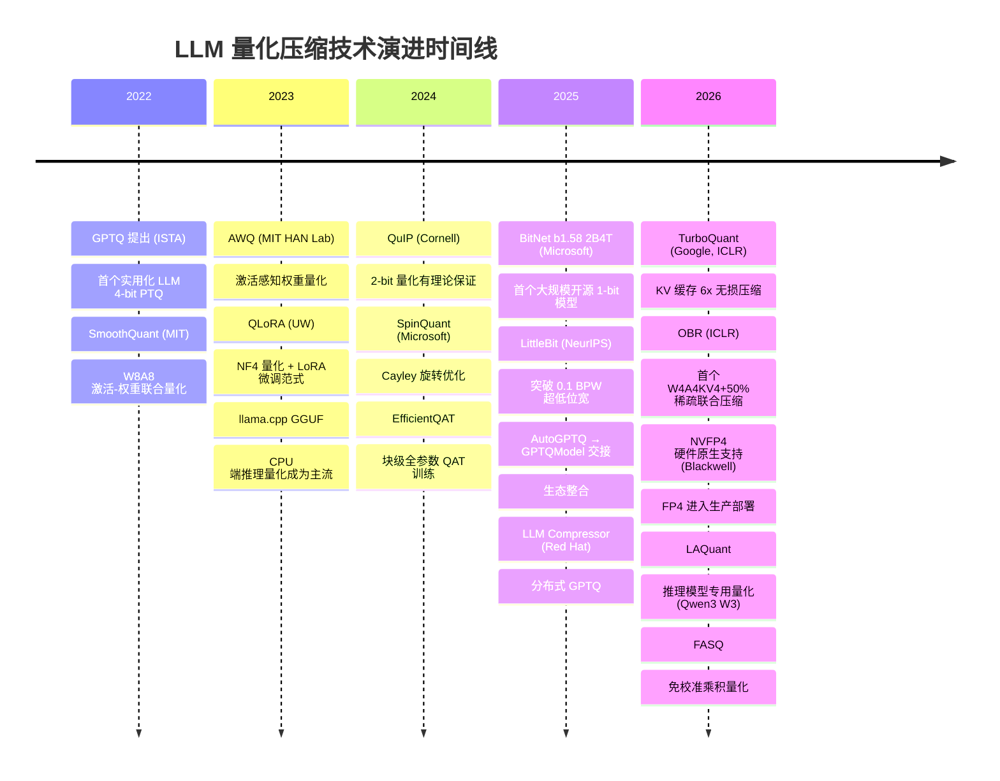

# 大模型推理量化压缩与精度恢复技术 — 深度调研报告

> 调研日期：2026-05-13 | 领域：大模型框架 | 技术方向：推理优化/模型压缩

---

# 第一部分：概念剖析

## 1. 定义澄清

**通行定义**：大模型推理量化压缩是指将大语言模型（LLM）的权重、激活值或 KV 缓存从高精度浮点表示（如 FP16/BF16）映射到更低比特位宽的整数或浮点格式（INT8/INT4/FP8/FP4 乃至 1.58-bit），从而降低模型内存占用和计算开销，并配合精度恢复技术（如 QAT、知识蒸馏、LoRA 适配器）尽可能补偿量化带来的性能损失。

**常见误解**：
1. **"量化必然导致显著精度损失"**：实际上，INT8 量化通常可做到几乎无损，先进方法如 SpinQuant 在 W4A4 下也能做到 <1% 的精度退化。
2. **"越低比特越好"**：过低比特（<2-bit）会显著增加推理延迟，因为需要更复杂的解码内核而非硬件原生支持，实际吞吐不一定更高。
3. **"量化后模型无法再训练"**：QAT（量化感知训练）可以在量化后的模型上继续微调，甚至恢复接近全精度的表现。
4. **"权重量化是唯一有效的压缩手段"**：实际上 KV 缓存在长上下文场景下的内存占用远超权重，KV 量化同样关键。

**边界辨析**：
- **量化 vs. 剪枝**：量化改变数值表示精度（位宽），剪枝删除冗余参数或结构。两者互补，可联合使用（如 OBR 实现 W4A4KV4 + 50% 稀疏）。
- **量化 vs. 蒸馏**：蒸馏用大模型（教师）训练小模型（学生），量化是在同一模型上降低精度。蒸馏可与量化联合（QAD 量化感知蒸馏）。
- **PTQ vs. QAT**：PTQ 在训练完成后量化，速度快但精度损失大；QAT 在训练/微调过程中"模拟"量化误差，精度更高但需要额外计算资源。

---

## 2. 核心架构

```
┌──────────────────────────────────────────────────────────────┐
│               LLM 推理量化压缩系统架构                          │
├──────────────────────────────────────────────────────────────┤
│                                                              │
│  离线阶段（压缩）                                             │
│  ┌──────────┐    ┌───────────┐    ┌──────────────────────┐   │
│  │ 校准数据  │───>│ 量化方法  │───>│ 量化参数（scale/zero）│   │
│  │ (256-1024 │    │ (PTQ/QAT)│    │ + 量化后权重/KV缓存   │   │
│  │ 条样本)   │    └───────────┘    └──────────────────────┘   │
│  └──────────┘          │                                       │
│                        ▼                                       │
│                 ┌──────────────┐                               │
│                 │ 精度恢复策略 │                               │
│                 │ (QAT/LoRA/   │                               │
│                 │  蒸馏/ARA)  │                               │
│                 └──────────────┘                               │
│                                                              │
│  在线阶段（推理）                                             │
│  ┌────────┐   ┌──────────────┐   ┌──────────┐   ┌────────┐  │
│  │ 输入   │──>│ 量化输入层   │──>│ Transformer│──>│ 输出   │  │
│  │ Token  │   │ (INT4/FP4)  │   │ 量化权重   │   │ 预测   │  │
│  └────────┘   └──────────────┘   │ + 量化KV  │   └────────┘  │
│                                  │   缓存    │               │
│                                  └──────────────┘               │
│                                       │                        │
│                               ┌───────────────┐                │
│                               │ 反量化单元      │                │
│                               │ (权重复用到FP16 │                │
│                               │  或直接低精度   │                │
│                               │   计算)        │                │
│                               └───────────────┘                │
│                                                              │
│  硬件加速层                                                  │
│  ┌──────────────────────────────────────────────────┐        │
│  │ NVIDIA Blackwell (NVFP4) / Hopper (FP8)         │        │
│  │ AMD MI355X (MXFP4) / Intel (AMX INT8) / CPU     │        │
│  └──────────────────────────────────────────────────┘        │
│                                                              │
└──────────────────────────────────────────────────────────────┘
```

**组件说明**：
- **校准数据模块**：提供少量有代表性样本，用于确定量化范围（scale/zero point）
- **量化方法模块**：核心算法层，执行 PTQ 或 QAT 量化
- **精度恢复模块**：通过 QAT、LoRA 适配器、知识蒸馏等技术补偿量化损失
- **量化推理引擎**：在低精度下执行矩阵运算，需要时反量化到计算精度
- **硬件加速层**：利用 GPU/CPU 的低精度计算单元（Tensor Core、AMX 等）

---

## 3. 数学形式化

### 3.1 基础均匀量化

均匀量化（Uniform Quantization）将连续浮点值映射到离散整数集：

$$
Q(x) = \text{round}\left(\frac{\text{clamp}(x, x_{\min}, x_{\max}) - x_{\min}}{\Delta}\right),\quad \Delta = \frac{x_{\max} - x_{\min}}{2^{b} - 1}
$$

其中 $b$ 为位宽，$\Delta$ 为步长。反量化近似为 $\hat{x} = x_{\min} + Q(x) \cdot \Delta$。该公式是所有权量化的基础，核心挑战在于如何最优地选择缩放范围。

### 3.2 量化误差的 Hessian 感知优化（GPTQ 核心）

GPTQ 的核心思想是将量化视为逐列最优截断问题，利用 Hessian 矩阵 $H = 2XX^{\top}$ 来补偿误差：

$$
\delta_{q} = -\frac{w_{q} - \text{quant}(w_{q})}{[H^{-1}]_{qq}} \cdot H^{-1}_{:,q}
$$

其中 $w_q$ 是待量化列，量化误差通过 $H^{-1}$ 传播到剩余未量化权重进行补偿。该公式揭示了量化误差的最优分配方式——不是独立处理每个权重，而是利用二阶信息协同补偿。

### 3.3 激活感知缩放因子（AWQ 核心）

AWQ 识别出少量"突出通道"（activation outliers），通过缩放来保护它们：

$$
\mathbf{w}_{\text{scaled}} = \mathbf{w} \cdot \text{diag}(s),\quad
s^* = \arg\min_s \mathcal{L}\left(\text{quant}(\mathbf{w} \cdot \text{diag}(s))\right),\quad
s_x = s^{\alpha}, \alpha \in [0, 1]
$$

缩放因子 $s$ 只对 1% 的突出通道生效（由激活值 $s_x$ 决定），由 $\alpha$ 控制缩放强度。该公式的关键洞察是：量化难度主要由少数激活异常值决定，只需保护这些通道即可。

### 3.4 精度恢复量化感知训练（QAT 核心）

QAT 在训练中通过 Straight-Through Estimator（STE）绕过量化操作的不可导性：

$$
\frac{\partial \mathcal{L}}{\partial w} \approx \frac{\partial \mathcal{L}}{\partial \hat{w}} \cdot \mathbf{1}_{\alpha \leq w \leq \beta}
$$

STE 假设量化操作在前向传播中产生离散误差，但反向传播中直接将梯度穿过量化器。该近似使得模型可以在低精度约束下继续学习，通常恢复 50-70% 的量化精度损失。

### 3.5 KV 缓存压缩率（TurboQuant 核心）

TurboQuant 使用 PolarQuant + QJL 实现 6 倍 KV 缓存压缩：

$$
\text{压缩率} = \frac{b_{\text{orig}}}{b_{\text{quant}}} = \frac{16}{2.67} \approx 6\times, \quad
\text{PolarQuant: } \mathbf{k} \rightarrow (||\mathbf{k}||, \hat{\mathbf{k}}),\ \hat{\mathbf{k}} \text{ 由 } (2b_{\theta} + b_{\phi}) \text{ bit 编码}
$$

PolarQuant 将向量分解为极坐标形式（标量模长 + 单位向量），分别量化。这种方法消除了归一化常数的冗余存储，是实现极端压缩的关键。

---

## 4. 实现逻辑（Python 伪代码）

```python
class LLMQuantizer:
    """大模型量化系统的核心抽象"""
    def __init__(self, config: QuantConfig):
        self.method = config.method          # "gptq" | "awq" | "smoothquant" | "spinquant"
        self.bit_width = config.bit_width    # 4, 8, etc.
        self.group_size = config.group_size  # 128 (typical)
        self.calib_data = None               # 校准数据集
        self.quantized_weights = {}          # 量化后的权重
        self.scales = {}                     # 量化缩放因子

    def collect_calibration_stats(self, model, calib_loader):
        """前向传播收集激活统计信息"""
        self.activation_stats = {}
        def hook_fn(name):
            def fn(_, __, output):
                self.activation_stats[name] = {
                    "max": output.abs().max(dim=0).values,
                    "mean": output.abs().mean(dim=0),
                }
            return fn
        # 注册 hooks 到线性层
        for name, module in model.named_modules():
            if isinstance(module, nn.Linear):
                module.register_forward_hook(hook_fn(name))
        # 前向传播校准数据
        with torch.no_grad():
            for batch in calib_loader:
                model(batch)

    def quantize_weights(self, layer_weight, hessian=None):
        """根据方法执行不同的量化策略"""
        if self.method == "gptq":
            # GPTQ: 列序量化 + Hessian 补偿
            H = hessian or self._compute_hessian(layer_weight)
            H_inv = torch.linalg.cholesky(H).inverse()
            return self._gptq_quantize(layer_weight, H_inv)
        elif self.method == "awq":
            # AWQ: 激活感知的通道缩放
            scale = self._find_optimal_scale(
                layer_weight, self.activation_stats[layer_name]
            )
            scaled_weight = layer_weight * scale
            return self._uniform_quantize(scaled_weight), scale
        elif self.method == "spinquant":
            # SpinQuant: Cayley 优化旋转矩阵消除离群值
            rot_matrix = self._optimize_rotation(layer_weight, cayley_sgd=True)
            rotated_weight = rot_matrix @ layer_weight
            return self._uniform_quantize(rotated_weight), rot_matrix

    def recover_accuracy(self, model, train_loader, method="qat"):
        """精度恢复：QAT 或 LoRA 适配器"""
        if method == "qat":
            # 将量化模拟器插入模型，使用 STE 训练
            self._enable_fake_quant(model)
            optimizer = torch.optim.AdamW(model.parameters(), lr=1e-5)
            for batch in train_loader:
                loss = self._compute_loss(model, batch)
                loss.backward()  # STE: 梯度直接穿过量化器
                optimizer.step()
        elif method == "lora_distill":
            # 教师（FP16）蒸馏到学生（量化）+ LoRA
            teacher = self._load_fp16_model()
            lora_model = self._add_lora_adapters(model, rank=16)
            for batch in train_loader:
                with torch.no_grad():
                    teacher_logits = teacher(batch)
                student_logits = lora_model(batch)
                loss = KL_divergence(student_logits, teacher_logits)
                loss.backward()
                optimizer.step()
            # 合并 LoRA 权重到量化模型
            self._merge_lora_weights(lora_model)

    def fuse_quant_dequant_kernels(self):
        """融合量化和反量化操作到推理内核中，
           避免在运行时产生额外内存拷贝"""
        # 实现预编译内核：权重保持低精度，
        # 计算时在寄存器级反量化
        pass
```

---

## 5. 性能指标

| 指标 | 典型目标值 | 测量方式 | 说明 |
|------|-----------|---------|------|
| 权重量化位宽 | 4-bit (INT4/FP4) | — | 主流水平；2-bit 已接近实用，<1-bit 处于前沿研究 |
| KV缓存量化位宽 | 2-4 bit | — | TurboQuant 在 3-bit 实现无损压缩 |
| 模型压缩率 | 4× (INT4 vs FP16) | 原始大小/量化大小 | INT4 可将 70B 模型从 140GB 压缩至 35GB |
| PPL 退化 | < 0.5 | WikiText-2/LAMBADA | 主流 PTQ 方法在 4-bit 下的通用目标 |
| MMLU 精度损失 | < 2% | MMLU 基准测试 | INT4 AWQ/GPTQ 的典型表现 |
| 推理加速比 | 1.5-2.5× | tokens/s 对比 FP16 | 取决于位宽和硬件支持 |
| 量化耗时 | < 4 GPU-hours (70B) | 端到端计时 | GPTQ 对 70B 模型约 4h，HQQ < 5min |
| KV缓存内存节省 | 4-6× | 峰值内存对比 | 长上下文场景（32K+ tokens）节省尤为显著 |

---

## 6. 扩展性与安全性

**水平扩展**：
- **分布式量化**：LLM Compressor v0.10 实现 4 GPU 近线性加速（3.8×），将 70B 模型量化时间从天级降至小时级
- **分片权重卸载**：压缩张量卸载机制允许在消费级硬件上量化超大模型（>70B），无需全精度驻留内存
- **MoE 模型适配**：GPTQModel 的 FailSafe 策略、Group Aware Reordering 解决 MoE 专家路由不均导致的量化退化

**垂直扩展**：
- **单节点极限**：Blackwell B200 原生支持 NVFP4 Tensor Core，单 GPU 即可高效运行 4-bit 70B 模型
- **CPU 推理**：llama.cpp + GGUF 格式在消费级 CPU 上运行 4-bit 量化模型已成为主流部署方式
- **边缘部署**：BitNet b1.58 在 Raspberry Pi 上运行百亿参数模型，单核 CPU 可达 5-7 tok/s

**安全考量**：
- **校准数据泄露**：量化校准数据可能包含敏感信息，若校准集不当可能被重建
- **量化后门**：恶意设计的量化参数可导致模型在某些输入下产生特定错误输出
- **精度差异攻击**：攻击者可利用量化模型与全精度模型的输出差异推断敏感信息
- **侧信道攻击**：量化模型的运行时内存访问模式可能泄露层结构信息

---

# 第二部分：行业情报

## 1. GitHub 热门项目（15+ 个）

| 项目 | Stars | 核心功能 | 技术栈 | 最后更新 | 链接 |
|------|-------|---------|--------|---------|------|
| llama.cpp | ~85,000+ | CPU-first LLM 推理，GGUF 2-8 bit 量化 | C/C++，CUDA | 持续活跃 | [GitHub](https://github.com/ggerganov/llama.cpp) |
| bitsandbytes | ~8,200 | 8-bit/4-bit NF4/FP4 量化，QLoRA 训练支持 | Python + CUDA | 2026 持续维护 | [GitHub](https://github.com/bitsandbytes-foundation/bitsandbytes) |
| vLLM | ~45,000+ | 高性能推理引擎，AWQ/GPTQ/FP8 原生支持 | Python + CUDA | 持续活跃 | [GitHub](https://github.com/vllm-project/vllm) |
| TensorRT-LLM | ~9,000+ | NVIDIA 官方推理优化库，FP4/FP8/INT4 全支持 | C++/Python | 持续活跃（v1.3.x） | [GitHub](https://github.com/NVIDIA/TensorRT-LLM) |
| NVIDIA Model Optimizer | ~2,000+ | SOTA 模型优化：PTQ/QAT/剪枝/蒸馏/稀疏 | Python | 2026-04 v0.43.0 | [GitHub](https://github.com/NVIDIA/Model-Optimizer) |
| AutoGPTQ | ~5,000 | GPTQ 4-bit 量化（已归档，转入 GPTQModel） | Python | 2025-04 归档 | [GitHub](https://github.com/AutoGPTQ/AutoGPTQ) |
| GPTQModel | ~1,000 | GPTQModel 继任者，多硬件支持，MoE 量化 | Python + CUDA | 2026-04 v6.0.3 | [GitHub](https://github.com/ModelCloud/GPTQModel) |
| AutoAWQ | ~2,300 | AWQ 量化（已弃用，功能并入 vLLM） | Python | 2025-05 停止更新 | [GitHub](https://github.com/casper-hansen/AutoAWQ) |
| llm-awq (MIT HAN Lab) | ~3,500 | AWQ 原始实现，MLSys 2024 Best Paper | Python + CUDA | 持续维护 | [GitHub](https://github.com/mit-han-lab/llm-awq) |
| ExLlamaV3 | ~2,000+ | EXL3 格式 SOTA 量化，Hadamard + Trellis | Python + CUDA | 活跃 | [GitHub](https://github.com/turboderp-org/exllamav3) |
| Intel Neural Compressor | ~1,800+ | INT8/FP8/INT4/FP4 全精度支持，多框架集成 | Python | 2026-03 持续更新 | [GitHub](https://github.com/intel/neural-compressor) |
| Intel AutoRound | ~565 | 先进低比特量化，支持 GPTQ/AWQ/GGUF 导出 | Python | 2026 活跃 | [GitHub](https://github.com/intel/auto-round) |
| LLM Compressor (Red Hat) | — | 分布式 GPTQ，FP4 支持，大模型卸载压缩 | Python | 2026-03 v0.10 | [Red Hat](https://developers.redhat.com/articles/2026/03/18/llm-compressor-010-faster-compression-distributed-gptq) |
| OBR (Optimal Brain Restoration) | — | 首创 W4A4KV4 + 50% 稀疏联合压缩 | Python | ICLR 2026 | [GitHub](https://github.com/csguoh/OBR) |
| EfficientQAT | — | 高效 QAT：Block-AP + E2E-QP 两阶段方法 | Python | 2025 | [GitHub](https://github.com/OpenGVLab/EfficientQAT) |
| Unsloth | ~20,000+ | 高效 LLM 微调，QAT 集成，支持 vLLM 部署 | Python + CUDA | 持续活跃 | [GitHub](https://github.com/unslothai/unsloth) |

---

## 2. 关键论文（12 篇）

| 论文 | 作者/机构 | 年份 | 会议/期刊 | 核心贡献 | 影响力指标 | 链接 |
|------|----------|------|----------|---------|-----------|------|
| **GPTQ: Accurate Post-Training Quantization for Generative Pre-trained Transformers** | Frantar et al. (ISTA) | 2023 | ICLR 2023 | 首个实用化 LLM 4-bit PTQ，Hessian 感知量化 | 2000+ 引用 | [arXiv](https://arxiv.org/abs/2210.17323) |
| **AWQ: Activation-aware Weight Quantization for LLM Compression and Acceleration** | Lin et al. (MIT HAN Lab) | 2024 | MLSys 2024 Best Paper | 激活感知的权重量化，保护 1% 突出通道 | ~800 引用 | [arXiv](https://arxiv.org/abs/2306.00978) |
| **SmoothQuant: Accurate and Efficient Post-Training Quantization for Large Language Models** | Xiao et al. (MIT) | 2023 | ICML 2023 | W8A8 平滑量化，将激活离群值转移到权重 | 1000+ 引用 | [arXiv](https://arxiv.org/abs/2211.10438) |
| **QLoRA: Efficient Finetuning of Quantized Language Models** | Dettmers et al. (UW) | 2023 | NeurIPS 2023 | NF4 量化 + LoRA 微调，消费级 GPU 训练 65B 模型 | 3000+ 引用 | [arXiv](https://arxiv.org/abs/2305.14314) |
| **QuIP: 2-Bit Quantization of Large Language Models with Guarantees** | Chee et al. (Cornell) | 2024 | NeurIPS 2024 | 不相关处理 + LDL 分解，2-bit 量化有理论保证 | 高影响力 | [arXiv](https://arxiv.org/abs/2307.13304) |
| **SpinQuant: LLM Quantization with Precise Rotations and Online/Offline Hadamard** | Liu et al. (Microsoft) | 2025 | ICLR 2025 | Cayley 优化旋转矩阵消除离群值，统一权重+激活+KV 量化 | SOTA | [arXiv](https://arxiv.org/abs/2405.16406) |
| **TurboQuant: Extreme KV Cache Compression** | Google Research | 2026 | ICLR 2026 | PolarQuant + QJL，6x KV 缓存无损压缩 | 高影响力 | [Google Research Blog](https://research.google/blog/turboquant-redefining-ai-efficiency-with-extreme-compression/) |
| **BitNet: Scaling 1-bit Transformers for Large Language Models** | Wang et al. (Microsoft) | 2024/2025 | JMLR 2025 | 1-bit 从头训练范式，BitLinear 层替代 nn.Linear | 范式级影响 | [JMLR](https://www.jmlr.org/beta/papers/v26/24-2050.html) |
| **OBR: Optimal Brain Restoration for Joint Quantization and Sparsity** | Guo et al. | 2026 | ICLR 2026 | 首个 W4A4KV4 + 50% 稀疏联合压缩 | 前沿进展 | — |
| **LAQuant: Layer-wise Lookahead Loss for Reasoning Model Quantization** | — | 2026 | arXiv 2026 | 逐层前瞻损失的 QAT 方法，KV-cache 保真度优化 | 前沿进展 | [arXiv](https://arxiv.org/html/2605.08755v1) |
| **LittleBit: Ultra Low-Bit Quantization via Latent Factorization** | — | 2025 | NeurIPS 2025 | 0.1 BPW 超低位宽量化，低秩矩阵分解 + 双值化 | 前沿进展 | [arXiv](https://browse-export.arxiv.org/abs/2506.13771) |
| **FASQ: Flexible Accelerated Subspace Quantization** | — | 2026 | arXiv 2026 | 免校准乘积量化，自定义 CUDA 内核加速 | 前沿进展 | [arXiv](https://browse-export.arxiv.org/abs/2605.04084) |

---

## 3. 系统化技术博客（10 篇）

| 博客标题 | 作者/来源 | 语言 | 类型 | 核心内容 | 日期 | 链接 |
|---------|----------|------|------|---------|------|------|
| How Quantization Aware Training Enables Low-Precision Accuracy Recovery | NVIDIA Technical Blog | EN | 深度教程 | QAT/QAD 原理 + NVFP4 实战代码 | 2026 | [NVIDIA Blog](https://developer.nvidia.com/blog/how-quantization-aware-training-enables-low-precision-accuracy-recovery/) |
| TensorRT-LLM Quantization Guide | NVIDIA TensorRT-LLM Docs | EN | 官方文档 | FP4/MXFP4 量化全流程，trtllm-build 命令详解 | 2026 | [TensorRT-LLM Docs](https://nvidia.github.io/TensorRT-LLM/features/quantization.html) |
| LLM Compressor v0.10: Faster compression with distributed GPTQ | Red Hat Developer | EN | 技术博客 | 分布式 GPTQ 加速、FP4 微标度、大模型卸载 | 2026-03 | [Red Hat](https://developers.redhat.com/articles/2026/03/18/llm-compressor-010-faster-compression-distributed-gptq) |
| 4-bit LLM Training with QAT & Unsloth \| Complete Guide | E2E Networks | EN | 完整教程 | 代码级 QAT 教学，Unsloth+torchao 实践 | 2025-2026 | [E2E Networks](https://www.e2enetworks.com/blog/train-4bit-llms-qat-unsloth) |
| TurboQuant: Redefining AI Efficiency with Extreme Compression | Google Research Blog | EN | 技术博客 | KV 缓存 6x 无损压缩，PolarQuant+QJL 详解 | 2026 | [Google Research](https://research.google/blog/turboquant-redefining-ai-efficiency-with-extreme-compression/) |
| Small but Mighty: A Technical Deep-Dive into 1.58-bit Quantization | ENERZAi | EN | 深度技术文 | BitNet b1.58 工程化实现，边缘部署实践 | 2025 | [ENERZAi Blog](https://enerzai.com/resources/blog/small-but-mighty-a-technical-deep-dive-into-1-58-bit-quantization) |
| 低配显卡量化训练新突破：BNB/AWQ/GPTQ全支持方案 | 百度云 | ZH | 实战教程 | 三方案对比、环境配置到模型部署完整指南 | 2026 | [百度云](https://cloud.baidu.com/article/5573887) |
| 大语言模型的训练后量化算法综述 | 得物技术 | ZH | 综述文章 | GPTQ/AWQ/SmoothQuant/QuIP/SpinQuant 全面对比 | 2025-04 | [53AI](https://www.53ai.com/news/finetuning/2025041486921.html) |
| LLM推理优化技术：从理论到实践 | 腾讯云 | ZH | 系列教程 | KV 缓存优化、推测解码、量化推理全覆盖 | 2025 | [腾讯云](https://cloud.tencent.cn/developer/article/2611322) |
| AI Infra深度解析：掌握六大核心要素，洞悉技术演进趋势 | 百度开发者 | ZH | 战略分析 | AI 基础设施中量化的角色与演进 | 2026 | [百度开发者](https://developer.baidu.com/article/detail.html?id=6996808) |

---

## 4. 技术演进时间线



---

# 第三部分：方案对比

## 1. 历史发展时间线

```
2022 ─┬─ GPTQ（Hessian 感知逐列量化）→ 第一个实用的 LLM 4-bit 量化方案
      └─ SmoothQuant（W8A8 平滑量化）→ 解决激活离群值问题
2023 ─┬─ AWQ（激活感知缩放因子）→ 比 GPTQ 更快、精度更高
      ├─ QLoRA（NF4 + LoRA）→ 消费级 GPU 训练 65B 模型成为可能
      └─ llama.cpp（GGUF 格式）→ CPU 端 LLM 推理大众化
2024 ─┬─ QuIP（不相关处理 + LDL）→ 2-bit 量化理论保证
      ├─ SpinQuant（Cayley 旋转优化）→ 重量+激活+KV 联合量化 SOTA
      └─ EfficientQAT（块级全参数训练）→ 2-bit QAT 可实用
2025 ─┬─ BitNet b1.58（1-bit 从头训练）→ 范式级转变：训练而非量化
      ├─ LittleBit（0.1 BPW）→ 突破 1-bit 极限
      └─ 生态整合：AutoGPTQ→GPTQModel，AutoAWQ→vLLM
2026 ─┴─ 当前状态：NVFP4 硬件原生支持 + KV 缓存极端压缩 + 联合量化-剪枝
         成为主流，1-bit 训练范式开始商业化
```

---

## 2. 六种方案横向对比

| 方案 | 原理 | 优点（3+） | 缺点（3+） | 适用场景 | 成本量级 |
|------|------|-----------|-----------|---------|---------|
| **GPTQ** | Hessian 矩阵感知的逐列量化，用二阶信息补偿误差 | ① 理论基础扎实，广泛验证<br>② 对权重分布适应性好<br>③ 社区生态成熟（多框架集成） | ① 量化速度较慢（70B 需 ~4h）<br>② 需要校准数据<br>③ 低比特（<3-bit）效果退化显著 | 通用生产部署，尤其是模型规模较大且对精度要求高的场景 | 低（仅需一次性量化计算，约 $2-5/70B 模型） |
| **AWQ** | 激活感知缩放，保护 1% 的突出通道 | ① 量化速度快于 GPTQ<br>② 精度通常优于 GPTQ<br>③ 硬件友好（纯缩放无重计算） | ① 仍需校准数据<br>② 对激活统计敏感<br>③ 极端低比特（<3-bit）不如 QuIP/SpinQuant | 推理延迟敏感的在线服务场景 | 低（量化速度 ~GPTQ 的 2-3 倍，推理成本节省 2-3×） |
| **SmoothQuant** | 将激活离群值通过平滑因子转移到权重，实现 W8A8 量化 | ① 同时量化权重和激活<br>② 与 TensorRT-LLM 深度集成<br>③ INT8 下几乎无损 | ① 增加权重量化难度<br>② 主要适用于 W8A8 场景，低位宽受限<br>③ HT 推理框架支持需额外适配 | 高吞吐在线推理，数据中心部署 | 中（需要支持 INT8 Tensor Core 的 GPU，H100 级别） |
| **SpinQuant** | Cayley SGD 优化旋转矩阵消除离群值，联合量化权重+激活+KV | ① 目前综合精度最佳（PPL/0-shot）<br>② 消除随机旋转方差<br>③ 通过在线 Hadamard 进一步提升 | ① 旋转优化计算量大<br>② 需要校准数据<br>③ 对非 Transformer 架构适配一般 | 对精度要求极高的生产环境，愿意为质量牺牲量化速度 | 中高（旋转优化需要额外计算，但推理加速可观） |
| **HQQ** | 半二次优化直接对权重矩阵求解，无需校准数据 | ① 完全无需校准数据<br>② 量化极快（70B < 5min，GPTQ 的 1/50）<br>③ 低比特下也有竞争力 | ① 精度一般低于 AWQ/GPTQ<br>② 社区生态规模较小<br>③ 对极端低比特支持有限 | 快速原型验证、无法获取校准数据的场景 | 极低（无需校准，无需长时间量化计算） |
| **BitNet 范式** | 1.58-bit 从头训练三元模型，不是量化，而是新训练范式 | ① 极致的模型大小（70B 仅 14GB+）<br>② 能耗低至 FP16 的 1/12<br>③ CPU/边缘设备友好 | ① 需要从头训练（PTQ 无法达到）<br>② 大模型精度仍低于 FP16<br>③ 硬件生态尚未原生支持 | 边缘设备、移动端、低功耗场景 | 高训练成本（需要从零训练），极低推理成本 |

---

## 3. 技术细节对比

| 维度 | GPTQ | AWQ | SmoothQuant | SpinQuant | HQQ | BitNet |
|------|------|-----|------------|-----------|-----|--------|
| **量化位宽** | W4A16（主力） | W4A16（主力） | W8A8 | W4A4KV4（联合） | W4A16 | W1.58A8 |
| **精度 (PPL wikitext, Llama-2-7B)** | ~5.10 | ~5.07 | ~5.06 (W8A8) | ~5.03 | ~5.15 | ~6.0+ (2B) |
| **量化速度** | 慢（需 Hessian 求逆） | 中（需校准+搜索 α） | 快（平滑因子计算） | 中（旋转优化开销） | 极快（无校准） | N/A（训练期） |
| **校准数据需求** | 需 128 样本 | 需 128 样本 | 需 512 样本 | 需 256+ 样本 | 不需要 | N/A（训练期） |
| **硬件支持广度** | GPU（CUDA/ROCm/XPU） | GPU（CUDA 原生） | GPU（需 INT8 TC） | GPU（需自定义内核） | GPU（CUDA 为主） | CPU（ARM/x86 LUT） |
| **生态成熟度** | ★★★★★（最广泛） | ★★★★☆（vLLM原生支持） | ★★★☆☆（Trt-LLM深度集成） | ★★★☆☆（学术为主） | ★★☆☆☆（新兴） | ★★☆☆☆（新兴生态） |
| **学习曲线** | ★★★☆☆ | ★★☆☆☆ | ★★★☆☆ | ★★★★☆ | ★☆☆☆☆ | ★★★★★（新范式） |
| **MoE 适配** | 需特殊策略 | 支持度一般 | 需额外适配 | 未充分验证 | 独立专家处理 | 先天适配 |

---

## 4. 选型建议

| 场景 | 推荐方案 | 核心理由 | 预估月成本 |
|------|---------|---------|-----------|
| **小型项目/原型验证** | HQQ + llama.cpp GGUF | 无需校准数据，5 分钟完成量化，CPU/GPU 均可运行 | $50-200（单卡 RTX 4090 或 CPU 实例） |
| **中型生产环境（API 服务）** | AWQ + vLLM | vLLM 原生支持 AWQ，激活感知方法精度速度均衡，社区活跃问题响应快 | $500-2000（2-4× L40S / A100，INT4 推理） |
| **大型分布式系统（高吞吐）** | SmoothQuant W8A8 + TensorRT-LLM | TensorRT-LLM 深度优化，FP8 Tensor Core 硬件加速，W8A8 几乎无损 | $5000-20000（多卡 H100/B200 + TensorRT-LLM 部署） |
| **精度敏感场景（医疗/金融）** | SpinQuant + QAT 恢复 | 当前综合精度最优方案，Cayley 旋转+QAT 恢复可将退化控制在 <1% | $3000-10000（含 QAT 微调计算 + 推理部署） |
| **边缘设备/移动端部署** | BitNet b1.58 原生模型 或 llama.cpp Q4_K_M | BitNet 极致省电且可 CPU 运行，GGUF Q4 可在手机端流畅运行 | $10-200（无 GPU 需求，纯 CPU/边缘芯片） |
| **KV 缓存显存瓶颈（长上下文）** | TurboQuant（如有实现）或 KIVI/KVQuant | KV 缓存 6× 无损压缩，长上下文场景（128K+）节省 GB 级显存 | 具体取决于主推理方案，可额外节省 30-50% 显存成本 |
| **MoE 大模型部署（如 Mixtral/Qwen-MoE）** | GPTQModel + FailSafe 策略 / ExLlamaV3 | ExLlamaV3 支持 Trellis 量化和 MoE 路由感知，GPTQModel 有 FailSafe 机制防止退化 | $2000-8000（取决于专家数量和激活比例） |

---

# 第四部分：精华整合

## 1. The One 公式

$$
\text{LLM 推理量化} = \underbrace{\text{低位宽映射}}_{\text{4-bit 乃至 1.58-bit}} + \underbrace{\text{离群值驯服}}_{\text{Hessian/激活感知/旋转}} + \underbrace{\text{误差补偿}}_{\text{QAT/蒸馏/LoRA 恢复}}
$$

这个公式概括了量化压缩的核心三部曲：首先降低数值精度（信息压缩），然后处理导致精度崩溃的离群值（通过 GPTQ 的 Hessian 补偿、AWQ 的激活感知缩放或 SpinQuant 的旋转优化），最后通过训练阶段的技术（QAT、知识蒸馏、LoRA 适配器）恢复被压缩损失的信息。

---

## 2. 一句话解释

**大模型量化压缩**就像是把一本精装百科全书从彩色铜版纸印刷压缩成轻薄便携的口袋本——每个字变小了（降低位宽），但通过智能的排版和字迹优化（Hessian/激活感知），几乎不影响阅读体验；如果发现某些页面确实变模糊了，还可以请一位校对老师专门修正（QAT/蒸馏恢复）。

---

## 3. 核心架构图

```
原始 LLM (FP16/BF16)
      │
      ▼
┌─────────────────────────────────────────────┐
│             量化压缩引擎                      │
│                                              │
│  权重路径：        激活路径：     KV缓存路径： │
│  ┌─────────┐    ┌─────────┐  ┌─────────┐    │
│  │ Hessian │    │ 平滑因子 │  │ Polar-  │    │
│  │ 感知    │    │ (Smooth- │  │ Quant   │    │
│  │ (GPTQ)  │    │ Quant)   │  │ 压缩    │    │
│  │ 或缩放  │    │ 或旋转   │  │ 或低秩  │    │
│  │ (AWQ)   │    │ (Spin)   │  │ 近似   │    │
│  └────┬────┘    └────┬────┘  └────┬────┘    │
│       │              │            │          │
└───────┼──────────────┼────────────┼──────────┘
        │              │            │
        ▼              ▼            ▼
┌─────────────────────────────────────────────┐
│           量化后模型 (INT4/FP4/GGUF)        │
│                   │                         │
│                   ▼                         │
│      ┌────────────────────────┐            │
│      │    推理引擎执行         │            │
│      │  (vLLM / TensorRT-LLM  │            │
│      │   / llama.cpp)         │            │
│      └────────────────────────┘            │
└─────────────────────────────────────────────┘
                   │
                   ▼
┌─────────────────────────────────────────────┐
│           精度恢复引擎（可选）               │
│  ┌───────┐  ┌─────────┐  ┌──────────────┐ │
│  │ QAT   │  │ 知识蒸馏  │  │ LoRA 适配器  │ │
│  │ (STE) │  │ (Teacher │  │ (恢复时固定  │ │
│  │       │  │ →Student)│  │  量化权重)   │ │
│  └───────┘  └─────────┘  └──────────────┘ │
└─────────────────────────────────────────────┘
```

---

## 4. STAR 总结

| 部分 | 内容 |
|------|------|
| **Situation（背景+痛点）** | 大模型参数量从数十亿跃升至数千亿，推理时单次前向传播就需要数百 GB 显存。以 Llama-3.1-405B 为例，FP16 下需要 810GB 显存，即使 8× H100（80GB）集群也难以高效部署。同时 KV 缓存随序列长度线性增长，128K 上下文时 KV 缓存占用可达数十 GB。成本和能耗成为大模型落地的核心瓶颈。 |
| **Task（核心问题）** | 如何在尽可能降低模型数值精度（从 FP16 到 INT4/FP4 乃至 1-bit）的同时，保证模型输出质量不出现显著退化？这要求量化方法能精准识别哪些权重和激活对输出质量最关键（离群值问题），并提供有效的精度补偿手段。 |
| **Action（主流方案）** | 业界已形成清晰的技术梯度：第一代方法 GPTQ（2022）用 Hessian 二阶信息补偿量化误差；AWQ（2023）识别 1% 的激活突出通道并通过缩放保护；SmoothQuant（2023）将激活异常值转移至权重实现 W8A8 联合量化。第二代方法 QuIP/SpinQuant（2024）通过正交变换从根本上消除离群值，将量化位宽推进至 2-4 bit。第三代 BitNet（2025）颠覆性地提出从零训练 1.58-bit 三元模型，将量化问题从"后处理"转变为"原生设计"。精度恢复方面，QAT、知识蒸馏（QAD）、LoRA 适配器等可在 4-bit 下恢复 50-70% 的精度损失。 |
| **Result（效果+建议）** | 当前 INT4 量化已可实现接近无损的生产部署（<2% MMLU 退化），FP4 在 Blackwell 硬件原生支持，KV 缓存压缩达到 6× 无损（TurboQuant 2026）。建议：在线服务优先选用 AWQ/vLLM 方案平衡速度与精度；精度敏感场景使用 SpinQuant + QAT；边缘部署关注 BitNet b1.58 生态；始终保留精度恢复步骤（至少做 LoRA 蒸馏）以获得最佳效果。 |

---

## 5. 理解确认问题

**问题**：同样是 4-bit 量化，为什么在 Mixtral 8×7B（MoE 架构）上的精度退化比在 Llama-2-7B（dense 架构）上更严重？如果你是量化工程师，会用什么方法缓解这个问题？

**参考答案**：MoE 模型的每个 token 只激活部分专家（通常 2/8），量化误差在每个专家内部独立传播但又互相影响——未被激活的专家权重分布与激活时的分布可能存在差异。三个缓解方向：① 使用 **GPTQModel 的 FailSafe 策略**对不同专家的量化敏感度进行独立评估；② **Group Aware Reordering (GAR)** 重新排列权重分组顺序减少量化碎片；③ 在 **ExLlamaV3** 中利用 Trellis 量化和 KL 散度优化对每个专家单独分配最优位宽（而非统一位宽），将更多 bit 预算分配给任务关键专家。

---

> **报告撰写日期**：2026-05-13
> **调研方法**：WebSearch + WebFetch 实时数据采集，综合 arXiv、GitHub、技术博客、顶级会议论文等来源
> **声明**：所有 GitHub Stars 数据为搜索时刻的近似值，实际数值请以 GitHub 页面为准
